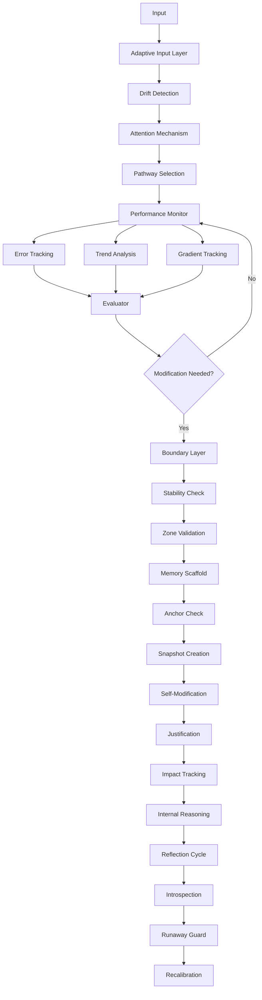

# Self-Modifying, Self-Reflective Reasoning System
> **Architectural Style: Hybrid Cognitive Loop**

A meta-cognitive AI system that creates a layered adaptive entity by combining rule-based reasoning, neural pattern matching, and meta-modification policies.

## 🧠 Overview

This system allows the "Seed" to evolve its reasoning capabilities through a **Hybrid Cognitive Loop** that coordinates three distinct layers of intelligence:

1.  **Rule-Based Layer**: Explicit symbolic logic for known problem types (e.g., Math, Logic).
2.  **Neural Learning Layer**: Associative pattern matching that learns from success (Simple Hebbian-like learning).
3.  **Meta-Policy Layer**: High-level governance that overrides strategies during failure or drift.

Surrounding this core loop is a **Meta-Cognitive Cycle** of Observation, Evaluation, Modification, and Justification that allows the system to rewrite its own strategies autonomously.

---

## 🏗️ The Twelve Elements (Architecture)

The system is built upon **twelve essential elements** that enable autonomous learning and evolution:

### ✅ 1. Adaptive Input Layer
**Purpose**: Recognizes environmental drifts and adapts processing pathways.
- **Components**: DriftDetector, AttentionMechanism, PathwayAdapter
- **Key Features**: Statistical drift detection (KL-divergence), dynamic feature weighting, automatic baseline updates.

### ✅ 2. Enhanced Performance Monitor
**Purpose**: Tracks errors, trends, and gradients over time.
- **Enhancements**: Error categorization (accuracy/efficiency), multi-timescale trend analysis, performance rate-of-change tracking.

### ✅ 3. Self-Modification Engine
**Purpose**: Autonomous system modifications with full structural plasticity.
- **Capabilities**: Parameter tuning, strategy routing modification, reasoning pathway adaptation, learning rate adjustment.

### ✅ 4. Meta-Gradient Learner
**Purpose**: Optimizes *how* the system learns by tracking performance gradients (Phase 2).
- **Components**: GradientTracker (dPerformance/dParameter), AdaptationRateController, RuleEvolutionEngine.

### ✅ 5. Progressive Network
**Purpose**: Dynamically creates and manages new processing modules (Phase 3).
- **Components**: DynamicRouter, ModuleFactory (auto-generation of specialized nodes), Self-Expansion capabilities.

### ✅ 6. Memory Scaffold
**Purpose**: Preserves critical knowledge across updates.
- **Components**: ReplayBuffer (importance sampling), AnchorWeights, SnapshotMemory (rollback points), IdentityPreserver.

### ✅ 7. Contextual Boundary Layer
**Purpose**: Restricts updates to safe zones, preventing destabilization.
- **Safety Zones**: Core (10%), Stable (30%), Experimental (50-70%), Frozen (0%).

### ✅ 8. Hybrid Cognitive Loop
**Purpose**: Coordinates "Fast" (intuitive) and "Slow" (deliberate) thinking modes.
- **Capabilities**: Layer coordination, simple feedback integration, efficiency optimization.

### ✅ 9. Symbiotic Adapter
**Purpose**: Enables co-adaptation with the user via explicit and implicit signals (Phase 4).
- **Features**: Feedback processing, demonstration learning (few-shot), preference modeling.

### ✅ 10. Multi-Agent Adaptive Core
**Purpose**: Collaborative problem solving using specialized agent pools (Phase 5).
- **Components**: AgentPool (Analyst, Creative, Historian), ConsensusEngine (confidence-weighted voting).

### ✅ 11. Enhanced Justification Module
**Purpose**: Internal reasoning logging and meta-cognition.
- **Features**: Step-by-step reasoning traces, causal impact analysis, self-awareness of reasoning processes.

### ✅ 12. Enhanced Reflection Cycle
**Purpose**: Periodic introspection and runaway mutation prevention.
- **Features**: Periodic introspection (hourly), "Five Key Questions" analysis, runaway guard (thresholds).

---

## 📐 System Architecture



---

## 🔄 Complete Cognitive Loop

**Phase 1: INPUT ADAPTATION**
1. Detect drift in input distribution
2. Adjust attention weights
3. Select optimal processing pathway

**Phase 2: OBSERVATION**
4. Monitor performance metrics
5. Track errors and categorize
6. Calculate performance gradients
7. Analyze trends

**Phase 3: EVALUATION**
8. Detect signals from observations
9. Assess signal impact
10. Identify improvement opportunities

**Phase 4: MODIFICATION** (if autonomous)
11. Create pre-modification snapshot
12. Validate with Boundary Layer
13. Check Memory Scaffold constraints
14. Apply modification
15. Track for justification

**Phase 5: JUSTIFICATION**
16. Record before/after performance
17. Calculate impact score
18. Generate internal reasoning
19. Explain what changed and why

**Phase 6: META-LEARNING & REFLECTION**
20. Process gradient feedback (Meta-Gradient)
21. Adjust global learning rate
22. Perform introspection and answer key questions
23. Check for runaway mutations
24. Generate recalibrations

---

## 🚀 Quick Start

### Installation

```bash
# Install dependencies
pip install -r requirements.txt
```

### Running the System

**Interactive Mode** (CLI):
```bash
python main.py --mode interactive
```

**Web Dashboard**:
```bash
python main.py --mode dashboard
```
Then open http://localhost:5000 in your browser.

**Run Examples**:
```bash
# Logic puzzles
python main.py --mode examples --example logic

# Math problems
python main.py --mode examples --example math
```

---

## 📖 Usage Examples

### 1. Basic Problem Solving

```python
from core import ReasoningEngine
from models import Problem, ProblemType

# Create reasoning engine
engine = ReasoningEngine()

# Define a problem
problem = Problem(
    id="prob_001",
    description="Solve for x: 2x + 5 = 17",
    problem_type=ProblemType.MATH
)

# Solve (auto-selects best strategy)
solution, trace = engine.solve(problem)

print(f"Answer: {solution.answer}")
print(f"Confidence: {solution.confidence:.2%}")
print(f"Strategy: {solution.strategy_used.value}")
```

### 2. Full Seed Architecture Control

```python
from core import ReasoningEngine
from models import Problem, ProblemType

# Initialize with full Seed architecture
engine = ReasoningEngine(enable_cognitive_core=True)

# Verify elements
print(f"Adaptive Input: {engine.cognitive_core.adaptive_input is not None}")
print(f"Meta-Learner: {engine.cognitive_core.meta_learner is not None}")

# Enable autonomous mode (with all safety layers)
engine.cognitive_core.enable_autonomous_mode()

# Solve problem
problem = Problem(id="test_001", description="Complex logic puzzle...", problem_type=ProblemType.LOGIC)
solution, trace = engine.solve(problem)

# Check Memory Scaffold
status = engine.cognitive_core.memory_scaffold.get_status()
print(f"Experiences: {status['replay_buffer']['size']}")
print(f"Snapshots: {status['snapshots_count']}")

# Perform Introspection
if engine.cognitive_core.reflection_engine.should_introspect():
    introspection = engine.cognitive_core.reflection_engine.perform_introspection({})
    print(f"Recalibrations: {introspection['recalibrations']}")
```

---

## 📡 API Endpoints

### Adaptive Input & Memory
```bash
GET /api/seed/adaptive-input/status
GET /api/seed/memory-scaffold/status
GET /api/seed/memory-scaffold/snapshots
POST /api/seed/memory-scaffold/rollback
```

### Cognitive Core & Advanced
```bash
GET /api/cognitive/status
GET /api/cognitive/insights
GET /api/cognitive/explanation?modification_id=mod_001
GET /api/cognitive/meta-learner/status
GET /api/cognitive/progressive/status
POST /api/cognitive/autonomous
```

---

## 📁 Project Structure

```
S5/
├── core.py                 # Reasoning engine & orchestrator
├── cognitive_core.py       # Main cognitive loop controller
├── cognitive_observer.py   # Performance monitor
├── modification.py         # Self-modification engine
├── meta_learning.py        # Meta-learning bases
├── meta_gradient_learner.py# Phase 2: Gradient learner
├── progressive_network.py  # Phase 3: Network expansion
├── symbiotic_adapter.py    # Phase 4: User adaptation
├── multi_agent_core.py     # Phase 5: Agent collaboration
├── memory_scaffold.py      # Knowledge preservation
├── boundary_layer.py       # Safety boundaries
├── justification_engine.py # Explanability
├── reflection.py           # Introspection
├── models.py               # Data models
├── config.py               # Configuration
├── main.py                 # Entry point
└── dashboard.py            # Web interface
```

---

## ⚙️ Configuration & Safety

Edit `config.py` to customize system behavior.

### Safety Features
> [!CAUTION]
> Multiple safety layers protect against destabilization:

1.  **Adaptive Input**: Drift detection prevents sudden strategy changes.
2.  **Boundary Validation**:
    *   **Core**: 10% max change
    *   **Stable**: 30% max change (Parameters)
    *   **Experimental**: 70% max change
3.  **Memory Constraints**: Anchor weights lock critical parameters; identity preservation checks.
4.  **Reflection Guard**: Runaway mutation detection (< 0.8 mods/hour).
5.  **Justification Audit**: Complete modification history and rollback capability.

---

##  Performance Impact

*   **Overhead per session**: < 20ms (~1-2%)
*   **Periodic Operations**:
    *   Cognitive Loop: Every 5 mins
    *   Introspection: Every 1 hour

---

## 🤝 Contributing

Contributions are welcome!
*   Additional reasoning strategies
*   Enhanced visualization with D3.js
*   External knowledge base integration
